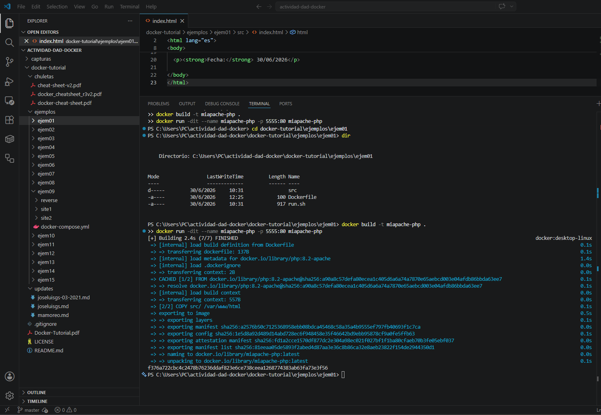
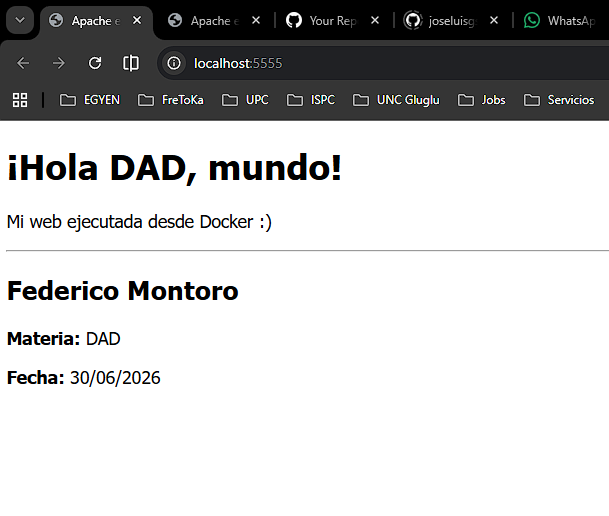

# Actividad DAD - Docker 2026 🐳

## Alumno

- **Federico Montoro**

## Materia

**DAD - Desarrollo y Administración**

## Objetivo

Implementar los ejemplos propuestos en el repositorio de José Luis González para comprender el funcionamiento de Docker, la creación de imágenes, la ejecución de contenedores y la administración básica de los mismos.

---

# Ejemplo 01

## Objetivos

- Construir una imagen Docker.
- Ejecutar un contenedor.
- Editar archivos dentro del contenedor.
- Editar archivos utilizando VS Code.
- Verificar el funcionamiento desde el navegador.

---

## Tecnologías utilizadas

- Docker Desktop
- Docker Engine
- PHP 8.2 + Apache
- Visual Studio Code
- GNU Nano

---

## Desarrollo

Durante este ejercicio se realizaron las siguientes tareas:

- Construcción de la imagen Docker.
- Ejecución del contenedor.
- Actualización del Dockerfile de PHP 7.0 a PHP 8.2.
- Instalación del editor Nano.
- Edición del archivo `index.html`.
- Verificación del sitio desde el navegador.
- Edición desde Visual Studio Code.

---

## Evidencias

### Construcción de la imagen

---

### Edición desde VS Code utilizando Nano

---

### Resultado final

---

## Estado

✅ Ejemplo 01 Finalizado
