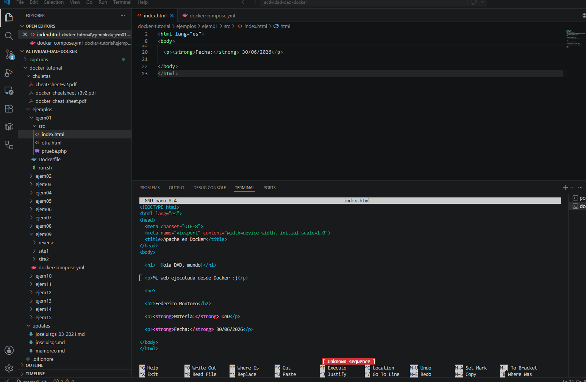
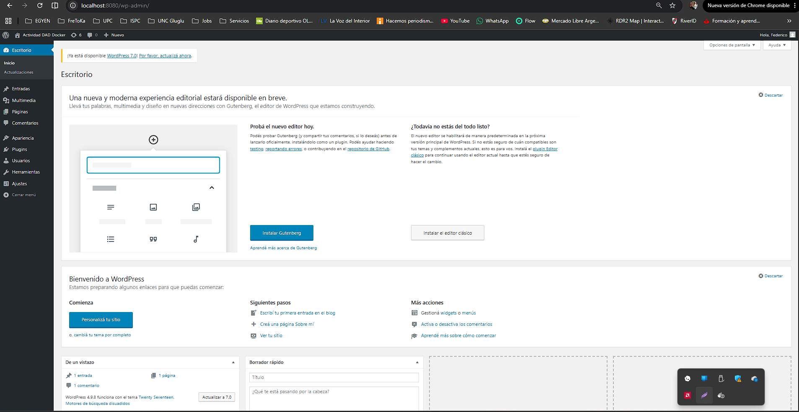
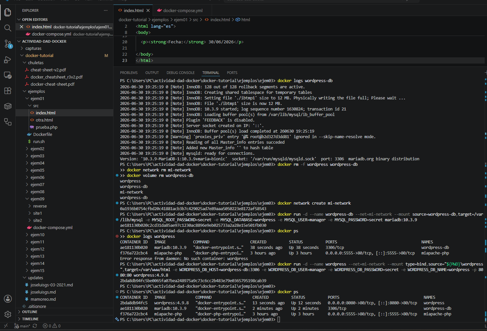
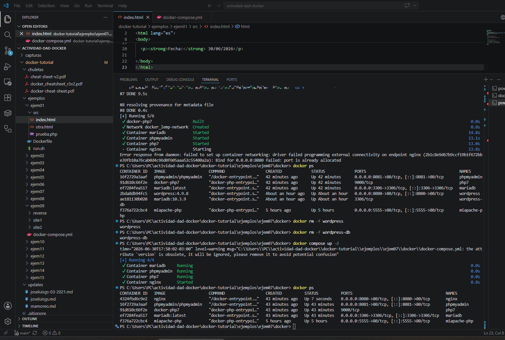
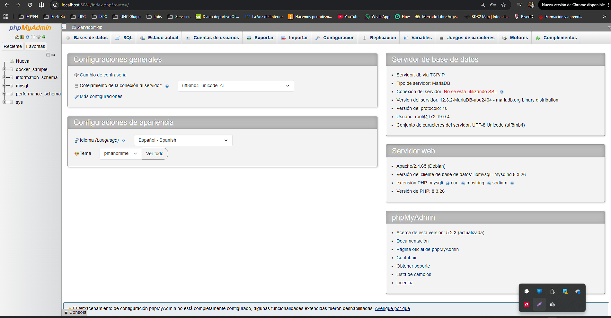

# 🐳 Actividad DAD - Docker 2026

Implementación de los ejemplos propuestos para la materia **Desarrollo y Administración (DAD)** utilizando **Docker Desktop**, **Visual Studio Code** y **PHP 8.2**.

---

# Alumno

- Federico Montoro

# Materia

- Desarrollo y Administración (DAD)

# Objetivo

Implementar los ejemplos desarrollados durante la materia para comprender el funcionamiento de Docker, la creación de imágenes, la administración de contenedores, las redes Docker y Docker Compose.

---

# Ejemplo 01

## Objetivos

- Construir una imagen Docker.
- Ejecutar un contenedor.
- Editar archivos dentro del contenedor.
- Utilizar Visual Studio Code junto a Nano.
- Verificar el funcionamiento desde el navegador.

---

## Tecnologías utilizadas

- Docker Desktop
- Docker Engine
- PHP 8.2 + Apache
- Visual Studio Code
- GNU Nano

---

## Desarrollo

Durante este ejemplo se realizaron las siguientes tareas:

- Construcción de la imagen Docker.
- Ejecución del contenedor.
- Edición del archivo **index.php** utilizando Nano.
- Apertura del proyecto desde Visual Studio Code.
- Verificación del funcionamiento mediante el navegador.

---

## Evidencias

### Construcción de la imagen

---

### Edición desde VS Code utilizando Nano

---

### Resultado final

---

## Estado

✅ Ejemplo 01 Finalizado

---

# Ejemplo 02

## Objetivos

- Interpretar el archivo **run.sh**.
- Ejecutar manualmente los comandos Docker.
- Crear un contenedor MariaDB.
- Crear un contenedor WordPress.
- Verificar el funcionamiento de la aplicación.

---

## Desarrollo

Durante este ejemplo se realizaron las siguientes tareas:

- Análisis del archivo **run.sh**.
- Ejecución manual de los comandos **docker run**.
- Creación del contenedor de base de datos MariaDB.
- Creación del contenedor WordPress.
- Configuración inicial del sitio.
- Verificación del panel de administración.

---

## Evidencias

### Instalación de WordPress

---

### Escritorio de WordPress

---

## Estado

✅ Ejemplo 02 Finalizado

---

# Ejemplo 03

## Objetivos

- Crear una red Docker personalizada.
- Comunicar contenedores mediante una red Docker.
- Desplegar WordPress utilizando MariaDB.
- Verificar el funcionamiento de la aplicación.

---

## Desarrollo

Durante este ejemplo se realizaron las siguientes tareas:

- Creación de la red Docker **mi-network**.
- Ejecución del contenedor MariaDB.
- Ejecución del contenedor WordPress.
- Comunicación entre contenedores mediante una red personalizada.
- Verificación del panel de administración.

---

## Evidencias

### Creación de la red Docker

---

### Escritorio de WordPress

---

## Estado

✅ Ejemplo 03 Finalizado

---

# Ejemplo 07

## Objetivos

- Implementar un entorno LEMP utilizando Docker Compose.
- Automatizar la creación de servicios mediante un archivo YAML.
- Administrar la base de datos utilizando phpMyAdmin.
- Verificar la comunicación entre todos los servicios.

---

## Tecnologías utilizadas

- Docker Compose
- Nginx
- PHP 8
- MariaDB
- phpMyAdmin

---

## Desarrollo

Durante este ejemplo se realizaron las siguientes tareas:

- Construcción del entorno mediante Docker Compose.
- Creación automática de la red Docker.
- Levantamiento de los servicios Nginx, PHP, MariaDB y phpMyAdmin.
- Verificación del funcionamiento del entorno.
- Acceso y administración de la base de datos desde phpMyAdmin.

---

## Evidencias

### Docker Compose

---

### phpMyAdmin

---

## Estado

✅ Ejemplo 07 Finalizado

---

# Conclusión

La actividad permitió comprender el ciclo completo de trabajo con Docker, desde la creación de imágenes y contenedores hasta la utilización de redes personalizadas y Docker Compose para automatizar entornos de desarrollo completos. Además, se verificó el funcionamiento de aplicaciones web basadas en PHP y la administración de bases de datos mediante MariaDB y phpMyAdmin.

---

**Universidad Provincial de Córdoba**  
**Tecnicatura Universitaria en Programación Full Stack**  
**Desarrollo y Administración (DAD) – 2026**
